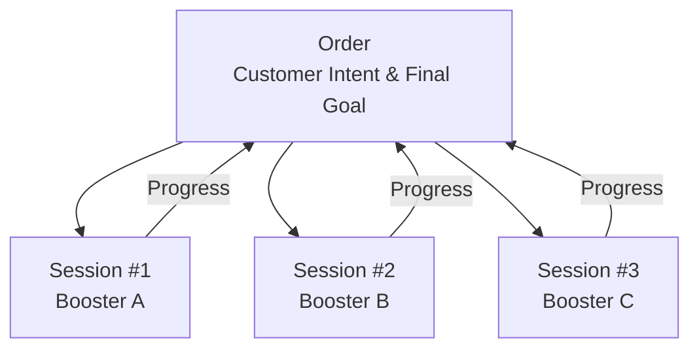

# SECTION 0 — CORE SYSTEM PRINCIPLES (IMMUTABLE)

These principles apply to every workflow below.

## Order ≠ Session
- An Order represents the customer’s intent and final goal
- A Session is one booster’s attempt on that order

## Boosting is probabilistic
- Wins and losses are both valid outcomes
- Progress (positive or negative) is always counted

## Rule-first & math-first
- No emotional refunds
- No manual judgment unless a session is flagged

## Chat is session-bound
- Chat exists only while a session is IN_PROGRESS
- Chat is disabled immediately when a session ends, pauses, or stops
- Messages are permanently logged for admins
## Diagram — Order vs Session

