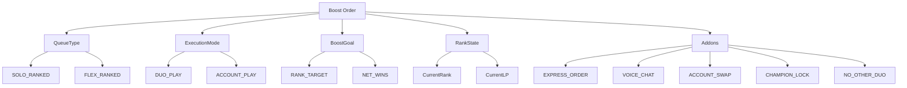

# SECTION 2 — BOOST STRUCTURE (LOCKED MODEL)

## 2.1 Queue Types
- SOLO_RANKED
- FLEX_RANKED

## 2.2 Execution Modes
- DUO_PLAY
- ACCOUNT_PLAY

## 2.3 Boost Goals
- RANK_TARGET (example: Gold IV → Gold II)
- NET_WINS (example: +4 wins)

## 2.4 Rank State
- Current rank
- Current LP (0–100)

## 2.5 Add-ons
- EXPRESS_ORDER
- VOICE_CHAT
- ACCOUNT_SWAP
- CHAMPION_LOCK
- NO_OTHER_DUO

All invalid combinations are blocked before payment.

## Diagram — Boost Structure Overview

