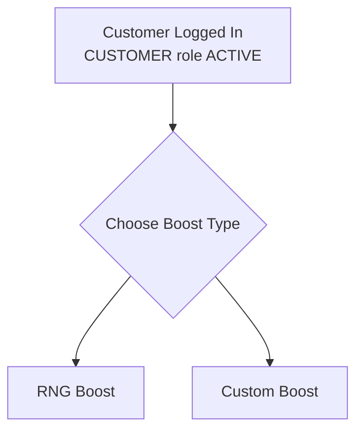

# SECTION 3 — CUSTOMER ENTRY WORKFLOW

## Requirements
- Customer must be logged in
- CUSTOMER role must be ACTIVE

## Customer chooses
- RNG Boost
- Custom Boost

## Diagram — Customer Entry Decision

