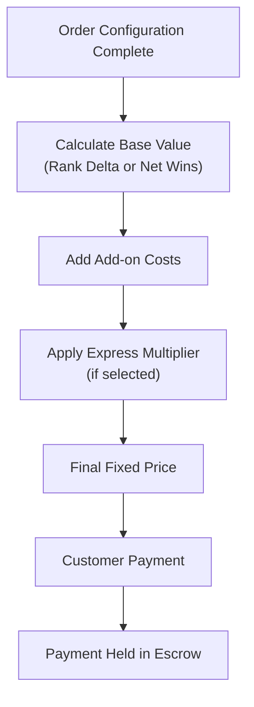

# SECTION 5 — ORDER PRICING & PAYMENT

System calculates:
- Base order value (rank delta or net wins)
- Add-on costs
- Express multiplier (if selected)

Customer sees a fixed price.

## Diagram — Order Pricing & Payment Flow

