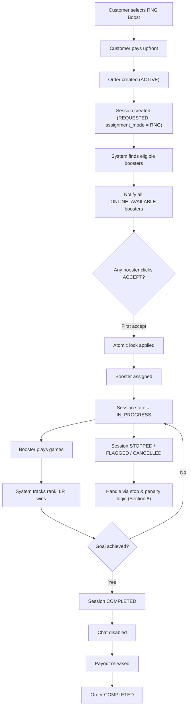

# SECTION 6 — RNG BOOST WORKFLOW

## 6.1 RNG Order Creation (Customer)
- Customer selects RNG Boost
- Customer pays upfront
- Order created → ACTIVE
- Session #1 created:
  - assignment_mode = RNG
  - session.state = REQUESTED
- Payment held in escrow

## 6.2 RNG Booster Assignment

### Eligible boosters
- BOOSTER role ACTIVE
- ONLINE_AVAILABLE
- Match rank, region, add-ons

### System behavior
All eligible boosters receive:
- Sound notification
- Popup with order summary
- Payout amount
- Express flag (if any)

## 6.3 RNG Acceptance
- First booster to click ACCEPT wins
- Backend applies atomic lock
- Booster assigned
- Session → IN_PROGRESS
- Booster → ONLINE_IN_SESSION
- Chat enabled

## 6.4 RNG Session Execution
- Booster plays games
- System tracks rank, LP, wins
- Add-ons enforced
- Chat allowed only while IN_PROGRESS

## 6.5 RNG Session End

### COMPLETED
- Goal achieved
- Session → COMPLETED
- Chat disabled
- Payout released
- Order → COMPLETED

### STOPPED / FLAGGED / CANCELLED
Handled via stop & penalty logic (see Section 8)

## ## Diagram — RNG Boost End-to-End Flow

