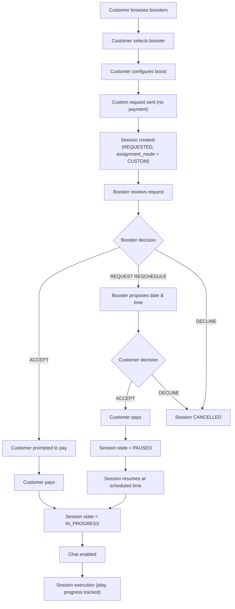

# SECTION 7 — CUSTOM BOOST WORKFLOW

## 7.1 Booster Browsing (Customer)

Customer can filter boosters by:
- Role (Top / Jungle / Mid / ADC / Support)
- Availability
- Rank
- Champions
- Rating

### Visible data
- Name
- Profile picture
- Rank
- Champion pool
- Role
- Short bio
- Rating

No chat allowed.

## 7.2 Custom Request Creation
- Customer selects booster
- Configures boost (same as RNG)
- Optionally proposes start time
- Sends request (no payment yet)

System:
- Order → ACTIVE
- Session created:
  - assignment_mode = CUSTOM
  - worker_id preset
  - session.state = REQUESTED

## 7.3 Booster Response (Custom)

### ACCEPT
- Customer prompted to pay
- On payment:
  - Session → IN_PROGRESS
  - Booster → ONLINE_IN_SESSION
  - Chat enabled

### REQUEST RESCHEDULE
- Booster proposes date & time
- Customer:
  - Accepts → pays → session PAUSED
  - Declines → session CANCELLED

### DECLINE
- Session CANCELLED
- Customer free to choose another booster

## 7.4 Custom Session Execution
Same rules as RNG:
- Chat only during IN_PROGRESS
- Progress tracked
- Add-ons enforced

## Diagram — Custom Boost End-to-End Flow

