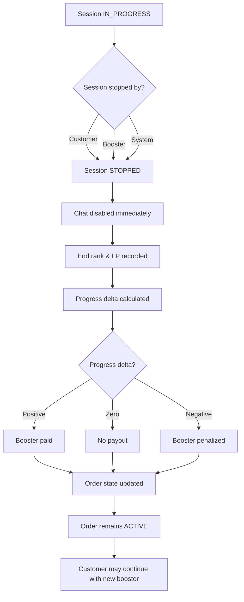

# SECTION 8 — SESSION STOPPING (EDGE CASE)

## 8.1 Who Can Stop a Session
- Customer
- Booster
- System (disconnects / violations)

Stopping is always allowed.

## 8.2 Immediate Effects of Stopping
- Session → STOPPED
- Chat disabled immediately
- End rank + LP recorded
- Progress delta calculated
- Payout / penalty computed

## 8.3 Progress Delta Calculation

progress_delta = end_state − start_state

### Examples
- +30 LP → positive
- −40 LP → negative
- +2 wins → positive
- −2 losses → negative

## 8.4 Session Payout / Penalty

Rules:
- Positive progress → booster paid
- Zero progress → no payout
- Negative progress → booster penalized

Penalty is deducted from booster balance or recorded as debt.

Stopping reason does not matter unless session is FLAGGED.

## 8.5 Order Update After Stop
- Order current rank + LP updated
- Remaining order price recalculated
- Order remains ACTIVE
- Customer may continue with a new booster

## Diagram — Session Stop & Penalty Logic

