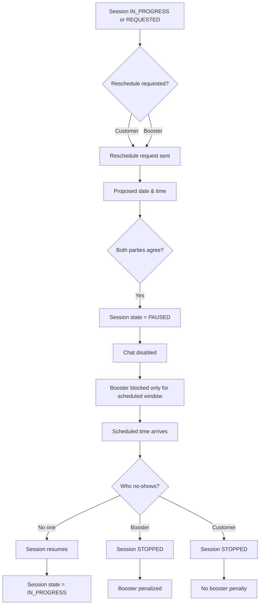

# SECTION 9 — RESCHEDULING WORKFLOW

## 9.1 Reschedule Process
- Either party requests reschedule
- Both agree on date & time
- Session → PAUSED
- Chat disabled
- Booster availability blocked only for that time window

Outside that window, booster may accept other orders.

## 9.2 Reschedule Failure
- Booster no-shows → STOPPED, booster penalized
- Customer no-shows → STOPPED, no booster penalty

Order continues.

## Diagram — Rescheduling Workflow

