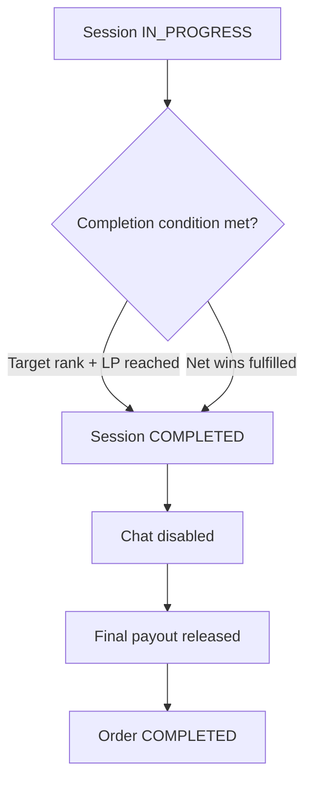

# SECTION 10 — SESSION COMPLETION

## 10.1 Successful Completion

Triggered when:
- Target rank + LP reached
OR
- Net wins fulfilled

System actions:
- Session → COMPLETED
- Chat disabled
- Final payout released
- Order → COMPLETED

## Diagram — Successful Session Completion

