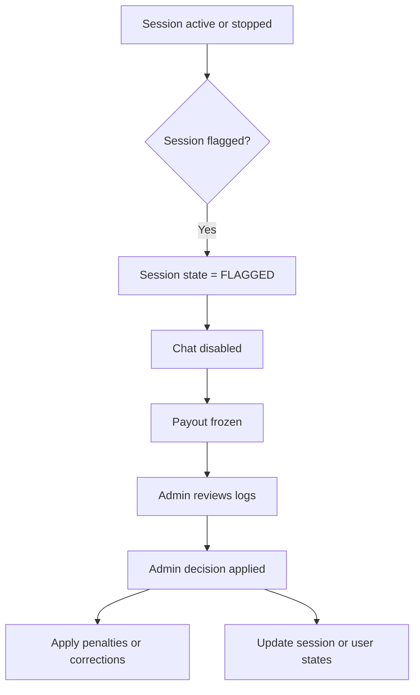

# SECTION 11 — ADMIN & SAFETY

## 11.1 Flagged Sessions

Sessions may be flagged for:
- Misconduct
- Cheating
- Rank fraud

### Effects
- Session → FLAGGED
- Chat disabled
- Payout frozen

Admins may:
- Review logs
- Apply penalties
- Update role states

All admin actions are logged.

## Diagram — Flagged Session Handling

