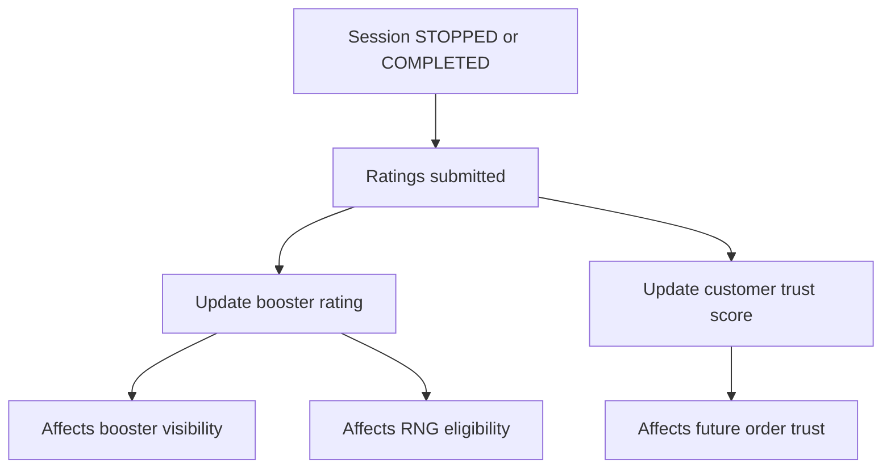

# SECTION 12 — RATINGS & REPUTATION

After STOPPED or COMPLETED sessions:
- Customer rates booster
- Booster rates customer

Ratings affect:
- Booster visibility
- RNG eligibility
- Customer trust score

## Diagram — Ratings & Reputation Impact

