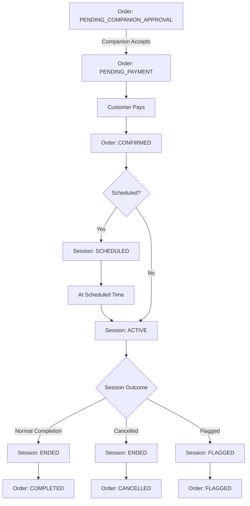

# COMPANION — ENTITIES & STATES

This document defines the core entities and state machines for the Companion system.

It applies to:
- Direct Booking
- RNG Booking

---

# 1. Companion Order (Persistent Entity)

An Order represents the commercial agreement between customer and companion.

It exists independently from the session lifecycle.

## Contains

- customer_id
- companion_id
- service_id
- pricing_model (PER_GAME / TIME_BASED / ONE_TIME)
- quantity (games or duration tier)
- total_price
- scheduled_time (optional)
- order_state

---

## Order States

- PENDING_COMPANION_APPROVAL
- PENDING_PAYMENT
- CONFIRMED
- COMPLETED
- CANCELLED
- FLAGGED

---

### State Meaning

PENDING_COMPANION_APPROVAL  
→ Scheduled request awaiting companion response.

PENDING_PAYMENT  
→ Companion accepted (or instant booking created), awaiting customer payment.

CONFIRMED  
→ Payment successful. Session is either ACTIVE or SCHEDULED.

COMPLETED  
→ Session ended normally.

CANCELLED  
→ Declined, expired, or cancelled before completion.

FLAGGED  
→ Under admin review.

---

# 2. Companion Session (Execution Entity)

A Session represents the execution of a confirmed order.

## Contains

- order_id
- start_timestamp
- end_timestamp
- games_completed (PER_GAME)
- time_consumed (TIME_BASED)
- session_state

---

## Session States

- SCHEDULED
- ACTIVE
- ENDED
- FLAGGED

---

### State Meaning

SCHEDULED  
→ Future session confirmed, waiting for start time.

ACTIVE  
→ Session currently running. Chat enabled.

ENDED  
→ Session finished normally or manually ended.

FLAGGED  
→ Session under admin investigation.

---

# 3. Companion Availability States

Availability determines booking eligibility.

## States

- OFFLINE
- ONLINE_AVAILABLE
- IN_SESSION
- SOFT_RESERVED (RNG)
- SCHEDULED

---

### Availability Meaning

OFFLINE  
→ Not visible for instant booking or RNG. May allow scheduled requests.

ONLINE_AVAILABLE  
→ Eligible for:
   - Instant booking
   - RNG matching
   - Scheduled booking

IN_SESSION  
→ Not eligible for:
   - Instant booking
   - RNG matching  
   Eligible for:
   - Scheduled booking (future time only)

SOFT_RESERVED (RNG)  
→ Temporarily reserved inside RNG pool.  
   Not eligible for:
   - Instant booking
   - Other RNG pools  
   Can accept scheduled bookings beyond safe time threshold.

SCHEDULED  
→ Has upcoming confirmed session.  
   Not eligible for:
   - Instant booking during overlapping time  
   Eligible for:
   - Additional scheduled bookings outside overlapping windows.

---

# Diagram — Order & Session Lifecycle

