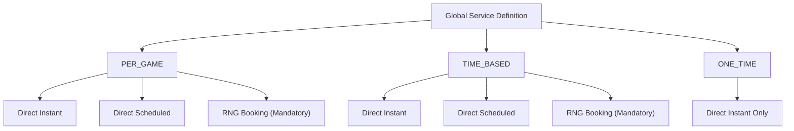

# COMPANION — SERVICE STRUCTURE (HYBRID)

Companion services follow a hybrid pricing model.

Service definitions are controlled at the platform level.
Pricing is defined individually by each companion.

There are three service types:

- PER_GAME
- TIME_BASED
- ONE_TIME

RNG Companion booking applies only to PER_GAME and TIME_BASED services.

ONE_TIME services do not participate in RNG.

---

## PER_GAME Services

Service definition (global):
- Game type
- Basic service description

Companion configuration:
- Companion enables the service.
- Companion sets their own price_per_game.

Customer selects:
- number_of_games

Total price = companion.price_per_game × number_of_games

Booking options:
- Direct Instant Booking
- Direct Scheduled Booking
- RNG Companion Booking (mandatory participation)

Session ends when:
- All games are completed
- Or session is manually ended

---

## TIME_BASED Services

Service definition (global):
- Service description
- Pricing model = TIME_BASED
- Duration tiers are platform-defined:
  - 15 minutes
  - 30 minutes
  - 60 minutes

Companion configuration:
- Companion chooses which duration tiers to enable.
- Companion sets price for each enabled tier.

Customer selects one of the available duration tiers.

Total price = companion.price_for_selected_tier

Booking options:
- Direct Instant Booking
- Direct Scheduled Booking
- RNG Companion Booking (mandatory participation)

Timer starts when session becomes ACTIVE.

Session ends when:
- Selected duration expires
- Or manually ended

---

## ONE_TIME Services

Service definition (global):
- Service description
- Pricing model = ONE_TIME
- Allowed platforms:
  - Discord
  - Instagram
  - Snapchat

Companion configuration:
- Companion enables the service.
- Companion sets a fixed price.

Customer purchases:
- One-time access action (e.g., add on selected platform).

Booking options:
- Direct Instant Booking only

ONE_TIME services:
- Do not participate in RNG
- Do not support scheduling
- Do not use timers

Delivery:
- Companion completes the agreed action after payment confirmation.

Characteristics:
- No timer
- No repetition
- No quantity multiplier

---

## Diagram — Service Models & Booking Paths

