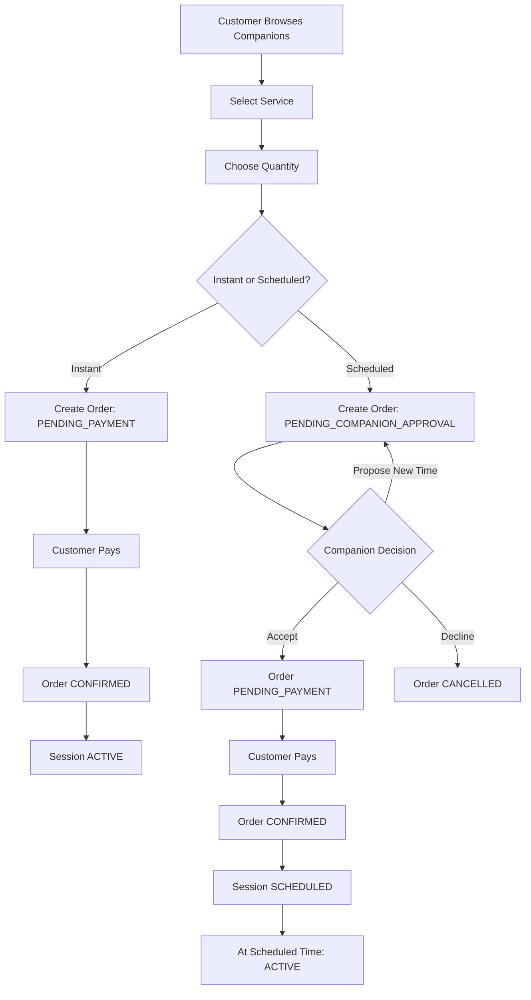

# COMPANION — DIRECT BOOKING WORKFLOW

This workflow applies to manual browsing and direct booking only.

RNG booking is documented separately.

---

## 1. Browse Companions

Customer can filter by:

- Online status  
- Service type  
- Price range  
- Rating  
- Language  

No chat is allowed before booking.

---

## 2. Booking Creation

Customer selects:

- Service  
- Quantity (game count or duration tier)  
- Booking type:
  - Instant
  - Scheduled  

System calculates total price.

---

# INSTANT BOOKING FLOW

Instant booking requires the companion to be:

- ONLINE_AVAILABLE  
- Not IN_SESSION  
- Not SOFT_RESERVED (RNG)  

### Instant Booking Steps

1. Order created → `PENDING_PAYMENT`
2. Customer pays
3. Order → `CONFIRMED`
4. Session → `ACTIVE`
5. Companion state → `IN_SESSION`

Chat becomes enabled immediately.

---

# SCHEDULED BOOKING FLOW

Scheduled booking requires companion approval before payment.

---

## 1. Request Creation

Customer selects:

- Future start time

System validates:

- No overlapping session
- No conflict with scheduled bookings

Order → `PENDING_COMPANION_APPROVAL`

No payment occurs at this stage.

---

## 2. Companion Decision

Companion can:

- ACCEPT  
- PROPOSE_NEW_TIME  
- DECLINE  

### If ACCEPT:
- Order → `PENDING_PAYMENT`
- Customer prompted to pay

### If PROPOSE_NEW_TIME:
- Customer can accept or decline new time
- Order remains `PENDING_COMPANION_APPROVAL`

### If DECLINE:
- Order → `CANCELLED`

---

## 3. Payment

After final time agreement:

1. Customer pays
2. Order → `CONFIRMED`
3. Session → `SCHEDULED`

---

## 4. Session Activation

At scheduled time:

- Session → `ACTIVE`
- Companion state → `IN_SESSION`
- Chat enabled

---

# Availability Rules (Direct Booking Only)

### ONLINE_AVAILABLE
- Can be booked instantly.
- Can receive scheduled requests.

### IN_SESSION
- Cannot be booked instantly.
- Can receive scheduled requests for future time.

### SCHEDULED
- Cannot be booked instantly during overlapping time.
- Can receive additional scheduled requests outside overlapping windows.

### OFFLINE
- Cannot be booked instantly.
- May receive scheduled requests (if enabled).

---

## Diagram — Direct Booking Flow

