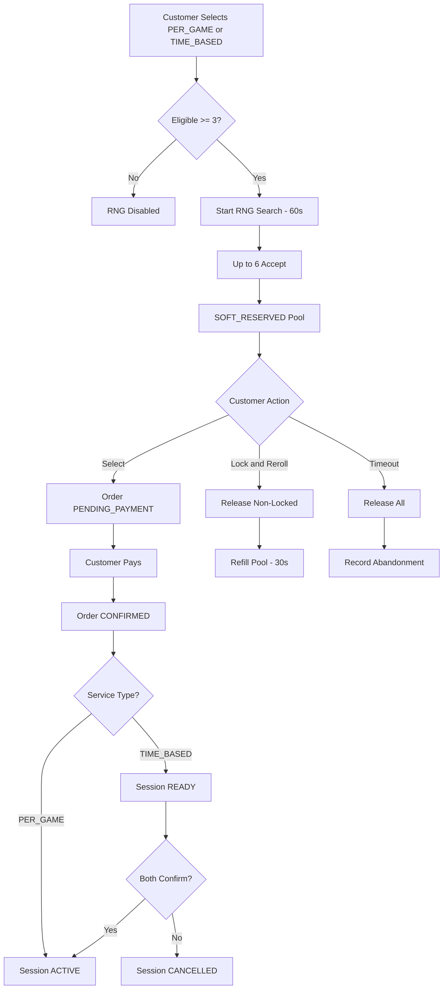

# COMPANION — RNG BOOKING WORKFLOW

RNG Booking allows customers to request a service and receive a pool of up to 6 eligible companions selected via weighted random matching.

RNG applies only to:
- PER_GAME services
- TIME_BASED services

RNG does NOT apply to:
- ONE_TIME services
- Scheduled bookings

Activation depends on service type.

---

## 1. RNG Eligibility Check

Customer selects:
- Service (PER_GAME or TIME_BASED only)
- Quantity (game count or duration tier)

System checks:

- Companion state = ONLINE_AVAILABLE
- Service enabled
- Not currently IN_SESSION
- Not SOFT_RESERVED in another RNG pool
- No scheduled session starting within unsafe threshold window

If eligible companions < 3:
- RNG option is hidden or disabled
- Customer is prompted to browse manually

---

## 2. RNG Search — Initial Round (60 Seconds)

Customer clicks "Start RNG Search".

System:
- Creates temporary RNG request
- Notifies eligible companions
- First accepted companions (max 6) form pool

All companions in pool:
- Become SOFT_RESERVED
- Remain visible on profile
- Cannot accept instant bookings
- Cannot join other RNG pools
- May accept scheduled bookings only beyond safe time threshold

Decision timer: 60 seconds

Customer can:
- Select one companion
- Lock up to 2 companions
- Reroll (max 2 times)

---

## 3. Reroll Logic (2 Max)

Each reroll:
- Duration: 30 seconds
- Locked companions remain reserved
- Non-locked companions are immediately released
- New eligible companions fill remaining slots (up to 6)

Maximum lock duration:
- Locked companions: 120 seconds total
- Non-locked companions: 60 seconds

All reservations automatically expire when:
- Selection is made
- Timer expires
- Customer abandons

---

## 4. Companion Selection & Payment

When customer selects a companion:

- All other companions are immediately released
- Order state → `PENDING_PAYMENT`
- Exact companion price is displayed
- Customer proceeds to payment

Upon successful payment:
- Order state → `CONFIRMED`

Activation now depends on service type:

### If PER_GAME:
- Session → `ACTIVE`
- Companion state → `IN_SESSION`
- Chat enabled immediately

### If TIME_BASED:
- Session → `READY`
- 5-minute handshake window begins
- Companion remains `ONLINE_AVAILABLE`
- After successful handshake → `ACTIVE`
- Companion state → `IN_SESSION`

Session execution begins only after activation rules are satisfied.

---

## 5. Abandonment Handling

If customer:
- Leaves page
- Does not select within timer
- Exhausts rerolls without choosing

System:
- Releases all reserved companions
- Records abandonment event

Cooldowns and abuse mitigation are defined in:

`23-abandonment-and-cooldown-policy.md`

---

## 6. Matching Logic (Internal)

Selection uses weighted random balancing:

- Rating influence
- Exposure balancing
- Acceptance reliability

Display order is shuffled to prevent visual bias.

RNG statistics are tracked for admin use only and are not visible to companions or customers.

---

## Diagram — RNG Companion Booking Flow (Service-Type Aware)

