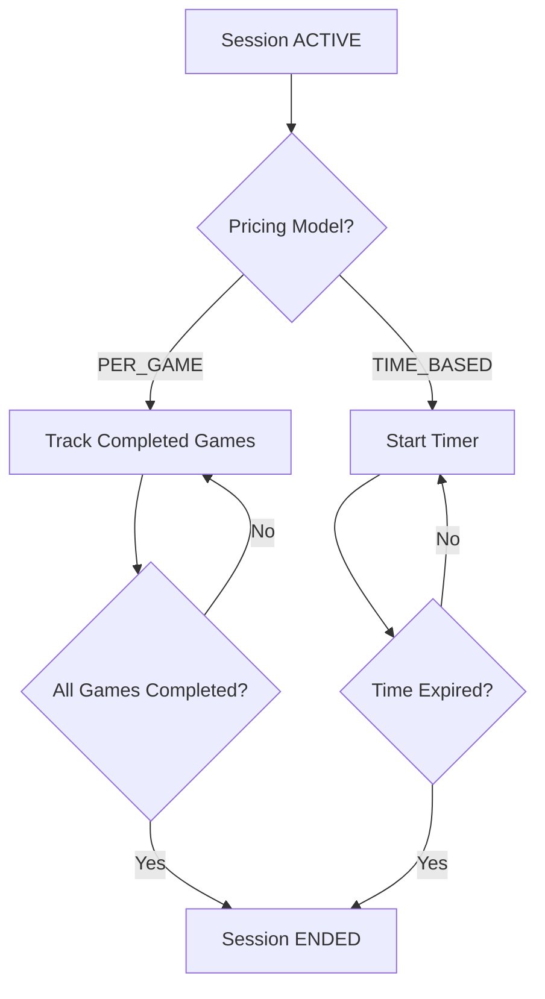

# COMPANION — SESSION EXECUTION

When a session becomes ACTIVE:

- Chat is enabled
- Companion state → IN_SESSION

---

## PER_GAME Execution

- System tracks completed games
- Counter increases after each finished game
- Session ends when all games are completed

---

## TIME_BASED Execution

- Timer starts at session activation
- Timer counts down
- Session ends automatically when time expires
- Session may also end manually

