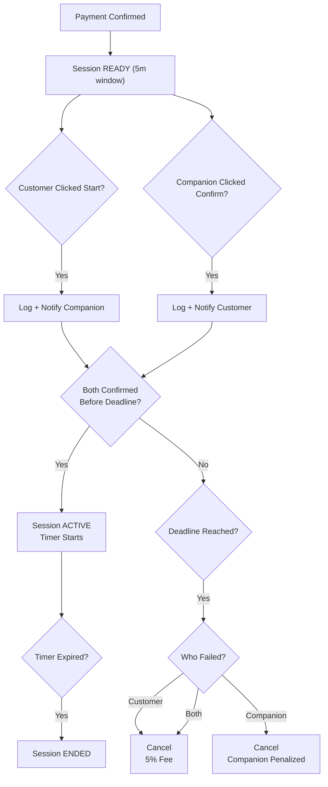

# COMPANION — SESSION EXECUTION

This document defines session execution rules for:

- DIRECT BOOKING
- TIME_BASED services only

PER_GAME and RNG sessions activate immediately after payment and do not use the READY handshake model.

---

# 1. Activation Model (Handshake-Based)

After payment:

- Session → READY
- Chat enabled
- Timer NOT running
- 5-minute handshake window begins
- Countdown is server-synced and visible to both parties

The READY phase exists to allow:

- Discord exchange
- Adding each other
- Joining voice
- Initial coordination

Service time does not start during READY.

All timing logic uses server timestamps only.

---

# 2. READY Phase Rules

Duration:

- Base window: 5 minutes
- One-time extension: +30 seconds (if triggered)
- Absolute maximum READY duration: 5 minutes 30 seconds
- No rolling extensions allowed

To activate session:

- Customer must click **"Start Session"**
- Companion must click **"Confirm Ready"**

Each confirmation:

- Is logged with server timestamp
- Triggers immediate notification to the other party

Session becomes ACTIVE only when BOTH confirmations are completed within the allowed window.

---

# 3. One-Time 30-Second Extension Logic

If one party confirms before the 5-minute deadline:

- The system grants a one-time 30-second extension
- The new deadline becomes:
  min(original_deadline + 30 seconds, 5m30s absolute cap)

The extension:

- Can only occur once
- Cannot exceed total READY duration of 5m30s
- Does not reset or stack

---

# 4. Handshake Failure Resolution

If the READY window expires and handshake is incomplete,
resolution is determined based on responsibility.

---

## Case A — Customer Did Not Click "Start Session"

- Session → CANCELLED
- 5% no-show fee deducted from customer's store credits
- No companion penalty

---

## Case B — Customer Clicked, Companion Did Not Confirm

- Session → CANCELLED
- Customer receives full refund in store credits
- Companion penalty applied:
  - max(5€, 40% of session value)
  - If insufficient balance → recorded as debt

---

## Case C — Neither Confirmed

- Session → CANCELLED
- 5% no-show fee deducted from customer
- No companion penalty

Customer is considered the primary initiator.

---

# 5. ACTIVE Phase (TIME_BASED Execution)

When both confirmations succeed:

- Session → ACTIVE
- Companion state → IN_SESSION
- Timer starts immediately

No additional grace period applies.

If customer disconnects:
- Timer continues
- No refunds

If companion disconnects during ACTIVE:
- Session may be flagged
- Admin review may apply penalties

---

# 6. Session End

Session ends when:

- Timer reaches zero
- Companion manually ends session
- Customer manually ends session
- Admin flags session

After end:

- Session → ENDED
- Order → COMPLETED (unless flagged)
- Chat disabled

---

# 7. Notification Policy During READY

To reduce accidental failures:

- Reminder notification sent every 1 minute during READY
- Final warning notification sent at 30 seconds remaining
- Immediate notification sent when the other party confirms

---

# 8. PER_GAME Execution (Unaffected)

For PER_GAME services:

- Session becomes ACTIVE immediately after payment
- No READY handshake phase
- System tracks completed games
- Session ends when all games are completed

---

# Diagram — TIME_BASED Direct Booking Execution

