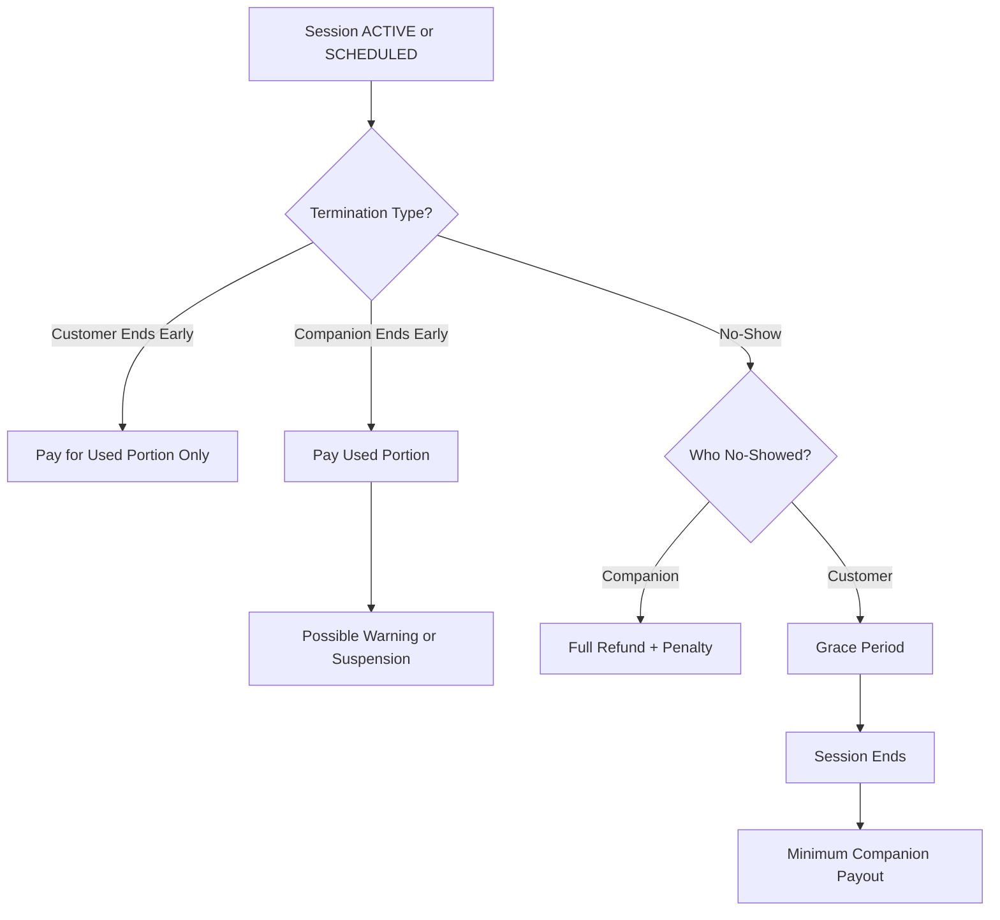

# COMPANION — EARLY TERMINATION RULES

Early termination applies when a session ends before its natural completion.

---

## 1. Customer Ends Early

### PER_GAME
- Companion is paid only for completed games.

### TIME_BASED
- Companion is paid only for elapsed time.

Remaining unused portion may be refunded based on platform policy.

---

## 2. Companion Ends Early

### PER_GAME
- Companion is paid only for completed games.
- Repeated abuse may lead to warning or suspension.

### TIME_BASED
- Companion is paid only for elapsed time.
- Repeated abuse may lead to warning or suspension.

---

## 3. No-Show (Scheduled Session)

### Companion No-Show
- Full refund to customer.
- Companion receives penalty.

### Customer No-Show
- Grace period applies.
- After grace period, session ends.
- Companion receives minimum guaranteed payout.

## Diagram — Early Termination Logic

