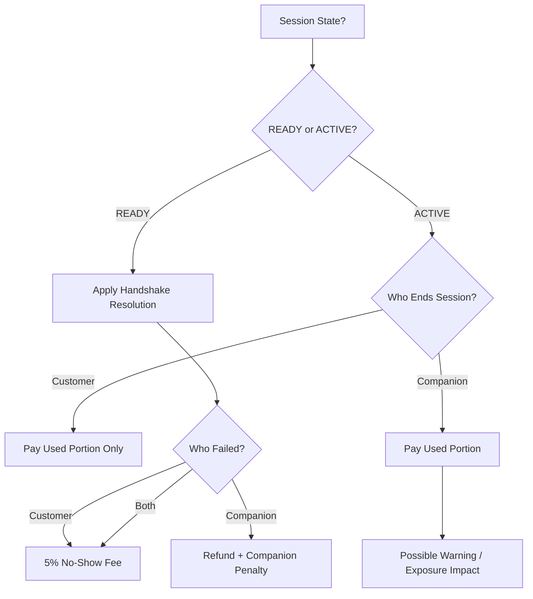

# COMPANION — EARLY TERMINATION RULES

Early termination applies only to sessions that have entered the ACTIVE state.

READY-phase handshake failures are NOT considered early termination.
They are handled by handshake resolution logic.

---

# 1. Scope

Early termination applies to:

- PER_GAME sessions (ACTIVE)
- TIME_BASED sessions (ACTIVE)

It does NOT apply to:

- READY phase failures
- Abandoned RNG selection
- Cancelled orders before activation

---

# 2. Customer Ends Session Early

Applies only when Session → ACTIVE.

### PER_GAME

- Companion is paid only for completed games.
- Remaining games are not compensated.

### TIME_BASED

- Companion is paid only for elapsed time.
- Timer stops at moment of termination.
- Remaining unused time is not charged.

Refund logic (if any) follows platform rules.

---

# 3. Companion Ends Session Early

Applies only when Session → ACTIVE.

### PER_GAME

- Companion is paid only for completed games.
- Repeated abuse may lead to:
  - Warning
  - Reduced exposure
  - Suspension

### TIME_BASED

- Companion is paid only for elapsed time.
- Repeated abuse may lead to:
  - Warning
  - Reduced exposure
  - Suspension

---

# 4. Scheduled Session No-Show

Scheduled sessions follow the same activation rules as instant bookings.

At scheduled start time:

If PER_GAME:
- Session becomes ACTIVE immediately.

If TIME_BASED:
- Session enters READY phase (5-minute handshake window).

No-show behavior is determined during activation.

---

## 4.1 Companion No-Show

If customer confirms but companion fails to confirm within handshake window:

- Session → CANCELLED
- Full refund to customer (store credits)
- Companion penalty applied:
  - max(5€, 40% of session value)

---

## 4.2 Customer No-Show

If customer fails to confirm within handshake window:

- Session → CANCELLED
- 5% no-show fee deducted from customer's store credits
- No companion compensation

---

## 4.3 Neither Confirmed

- Session → CANCELLED
- 5% no-show fee deducted from customer
- No companion penalty

Customer is primary initiator.

---

# 5. Technical Interruption During ACTIVE

If disconnection occurs during ACTIVE:

### Customer Disconnect
- Timer continues (TIME_BASED)
- Games continue counting (PER_GAME if applicable)
- No automatic refund

### Companion Disconnect
- Session may be flagged
- Admin review may apply penalty or compensation

---

# Diagram — Early Termination & No-Show Logic

