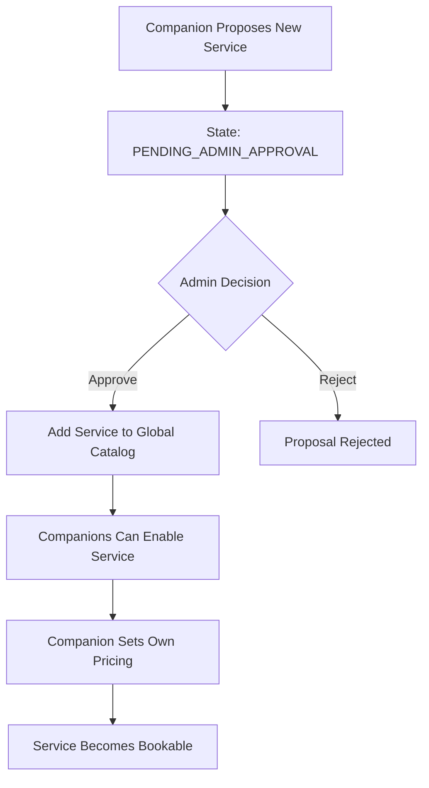

# COMPANION — GLOBAL CUSTOM SERVICE SYSTEM (ADMIN-CONTROLLED)

Custom services are created at the platform level.

Companions cannot create private custom services.

When a companion proposes a new custom service and it is approved,
it becomes a global service available to all companions.

---

## 1. Service Proposal Flow

1. Companion submits a new service proposal:
   - Service title
   - Description
   - Pricing model (PER_GAME or TIME_BASED)
   - Default duration rules (if applicable)

2. Service state → PENDING_ADMIN_APPROVAL

3. Admin reviews:
   - Content compliance
   - No sexual or prohibited services
   - Platform policy compliance

4. Admin decision:
   - APPROVED → Service added to global service catalog
   - REJECTED → Proposal discarded

---

## 2. Companion Service Activation

Once a service is approved globally:

1. Any companion can enable the service on their profile.
2. Companion sets their own pricing.
3. Service becomes bookable on that companion’s profile.

Pricing is defined individually per companion.
Service definition is controlled globally by admin.

## Diagram — Global Custom Service System

