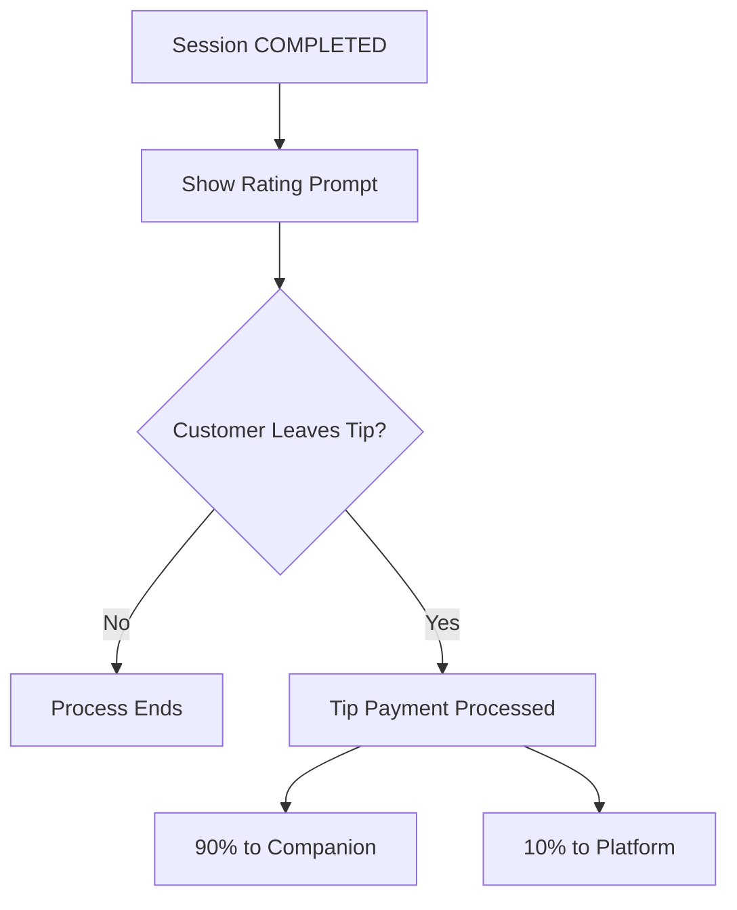

# COMPANION — TIPPING SYSTEM (POST-COMPLETION ONLY)

Tipping is optional and allowed only after a session is successfully completed.

Tips are separate from the original order payment.

---

## 1. Eligibility Rules

Tipping is available only if:

- Session state = ENDED
- Order state = COMPLETED
- Session is not FLAGGED

Tipping is not allowed for:
- STOPPED sessions
- CANCELLED sessions
- FLAGGED sessions
- Refunded orders

---

## 2. Tip Window

After session completion:

- Customer is prompted to rate the companion.
- Customer may optionally leave a tip.

Tip window remains active for a limited period (recommended: 24 hours).

After expiration, tipping is disabled.

---

## 3. Tip Distribution

Tip split:

- Companion receives 90%
- Platform receives 10%

Example:
If tip = 50€
- Companion receives 45€
- Platform receives 5€

---

## 4. Financial Rules

- Tips are processed as separate transactions.
- Tips are non-refundable except in confirmed fraud cases.
- If a chargeback occurs, the tip amount is deducted from the companion balance.

---

## 5. Abuse Prevention

- Companions may not pressure customers for tips.
- Repeated abuse may lead to warnings or suspension.

## Diagram — Tipping Flow

