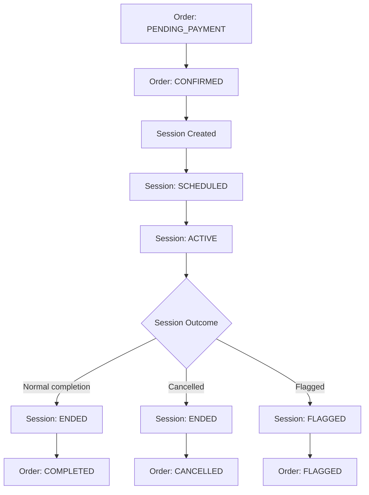

# COMPANION — ENTITIES & STATES

## Companion Order

Contains:
- customer_id
- companion_id
- service_type
- pricing_model (PER_GAME / TIME_BASED)
- quantity
- total_price
- scheduled_time (optional)
- order_state

Order States:
- PENDING_PAYMENT
- CONFIRMED
- IN_PROGRESS
- COMPLETED
- CANCELLED
- FLAGGED

---

## Companion Session

Contains:
- order_id
- start_timestamp
- end_timestamp
- games_completed
- time_consumed
- session_state

Session States:
- SCHEDULED
- ACTIVE
- ENDED
- FLAGGED

---

## Companion Availability

- OFFLINE
- ONLINE_AVAILABLE
- IN_SESSION
- SCHEDULED

