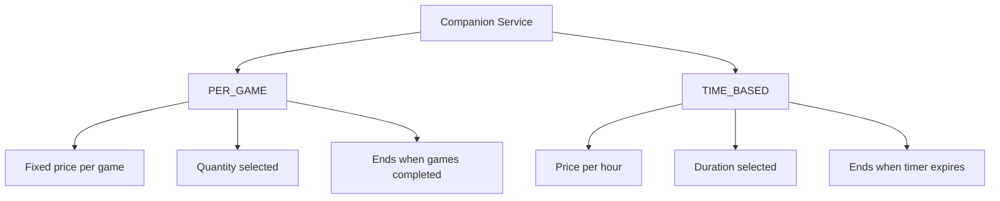

# COMPANION — SERVICE STRUCTURE (HYBRID)

Companion services follow a hybrid pricing model.

---

## PER_GAME Services (Fixed)

Defined by:
- game_type
- price_per_game

Customer selects:
- number_of_games

Total price = price_per_game × number_of_games

Session ends when:
- All games completed
- Or session manually ended

---

## TIME_BASED Services

Defined by:
- price_per_hour (internally calculated per minute)
- optional minimum duration

Customer selects:
- duration

Total price calculated upfront.

Timer starts when session becomes ACTIVE.

Session ends when:
- Time expires
- Or manually ended

