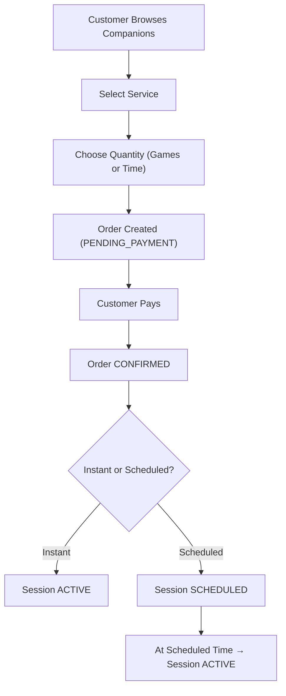

# COMPANION — BOOKING WORKFLOW

## 1. Browse Companions

Customer can filter by:
- Online status
- Service type
- Price range
- Rating
- Language

No chat allowed before booking.

---

## 2. Booking Creation

Customer selects:
- Service
- Quantity (games or duration)
- Instant or Scheduled

System calculates total price.

Order state → PENDING_PAYMENT

Customer pays → Order state → CONFIRMED

---

## 3. Session Creation

If booking is Instant:
- Session state → ACTIVE immediately

If booking is Scheduled:
- Session state → SCHEDULED
- Session becomes ACTIVE at scheduled time

